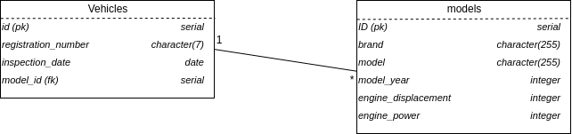
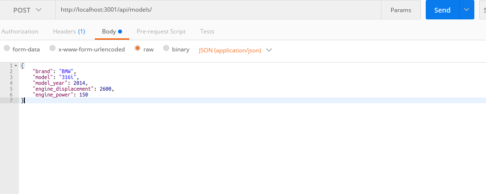
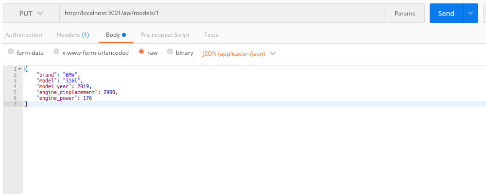
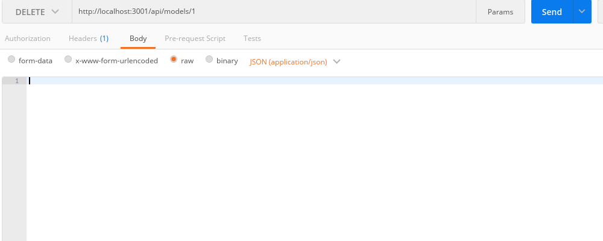

# FleetManager

# Installation
Following instructions are directed for linux.

Step 1: Install postgres to your system. Instructions can be found here: https://www.postgresql.org/download/

Step 2:
Our configuration uses default user 'postgres' with password 'password.
Search for pg_hba.conf file. On linux it should be located in /etc/postgresql/9.3/main/pg_hba.conf. Open it and locate the following line:
local all postgres md5

Make sure that it's 'md5', and not something else. This will allow us to use server connection locally.
Restart the server: sudo service postgresql restart.

Open the database editor with the following command:
sudo -u postgres psql

Add a password for the default user 'postgres' with the following query:
ALTER USER postgres WITH password 'password';

Now we've configured our database. If you want to create your own configuration make sure that you update /utils/config.js.

Step 3: Launch the server with start_server.sh on the first time, it will delete any existing tables, recreate them and insert the test data. The server will start at http://localhost:3001/. You can launch with npm run watch without removing the data.

# Models-table
GET: /api/models/
This will fetch all individual models in the fleet.

GET: /api/models/:id
This will fetch a single model in the fleet where the id is a parameter

POST: /api/models/
Post will create a new model to the fleet. This can be joined with vehicles-table to create a new vehicle.

Insert following data as raw JSON on postman:

{
    "brand": "BMW",
    "model": "316i",
    "model_year": 2014,
    "engine_displacement": 2600,
    "engine_power": 150
}

PUT: /api/models/:id
Updates a single model in the fleet where the id is a parameter

Insert following data as raw JSON on postman with 1
{
    "brand": "BMW",
    "model": "316i",
    "model_year": 2019,
    "engine_displacement": 2900,
    "engine_power": 176
}

DELETE: /api/models/:id
Deletes a single model from the fleet where the id is a parameter

GET: /api/models/brand/:brand
Fetches all models where the name of the brand is brand-parameter.

GET: /api/models/model/:model
Fetches all models where the name of the model is model-parameter.

GET: /api/models/year/:min/:max
Fetches all models created between min-and max-parameters. 

# Vehicles-table
/api/vehicles

GET: /api/vehicles/
This will fetch all vehicles in the fleet. The vehicle-table is joined with a model!

GET: /api/vehicles/:id
This will fetch a single vehicle in the fleet where the id is a parameter

POST: /api/vehicles
Post will create a new vehicle to the fleet. This must be joined with a model.

Insert following data as raw JSON on postman:

{
	"registration_number": "UUS-144",
	"inspection_date": "2017-01-22",
	"model_id": 1003
}

PUT: /api/vehicles/:id
Updates a single model in the fleet where the id is a parameter
Insert following data as raw JSON on postman with 1

{
	"registration_number": "ABC-123",
	"inspection_date": "2019-01-15",
	"model_id": 1000
}

DELETE: /api/vehicles/:id
Deletes a single model from the fleet where the id is a parameter

GET: /api/vehicles/brand/:brand
Fetches all vehicles where the name of the brand is brand-parameter.

GET: /api/vehicles/model/:model
Fetches all vehicles where the name of the model is model-parameter.

GET: /api/vehicles/year/:min/:max
Fetches all vehicles created between min-and max-parameters. 
